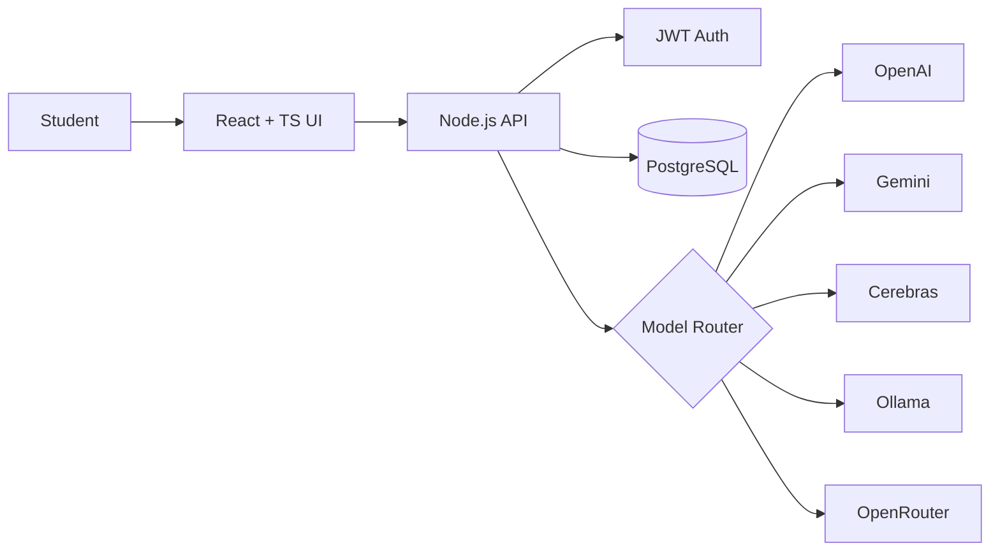

---

## 👋 About Me

Computer Science graduate (B.E., 2026) based in Mangalore, focused on **full-stack web** and **Android** development, with a strong interest in applied AI. I build complete products, from database schema to user interface, and integrate LLMs where they add real value.

- 🎓 **Education:** B.E. Computer Science Engineering, Srinivas Institute of Technology
- 💼 **Experience:** Generative AI Android Developer at MindMatrix; Python Full-Stack Intern at EduSkills AICTE
- 📄 **Research:** Published in JETIR on AI-based video summarization
- 🎯 **Seeking:** SDE and Full-Stack Developer roles
- 🌱 **Strengthening:** System design, Redis caching, message queues, RAG, Docker and CI/CD

---

## 🧰 Tech Stack

**Languages** 
  
**Frontend** 
  
**Backend** 
  
**Android** 
  
**Databases** 
  
**Tools and Deploy** 
  
**AI / LLMs** 

---

## 🚀 Featured Projects

### 🎓 Student AI Hub
> An AI productivity platform for students, powered by multiple LLM providers.

**Key features**
- Chatbot, learning roadmap generator, and resume analyzer
- Video summarization and code debugging assistant
- Unified routing across 5 AI providers: OpenAI, Gemini, Cerebras, Ollama, OpenRouter
- JWT authentication and real-time task management

**Tech:** `React` `TypeScript` `Node.js` `PostgreSQL`

---

### 🏥 Aethera: Clinic Management Suite
> A real-time platform that connects patients, doctors, and clinic staff.

**Key features**
- Smart token queue with live waiting-room monitoring
- Physician dashboards and dynamic prescriptions
- Instant updates across all users using Server-Sent Events
- Role-based access control for patients, doctors, and admins

**Tech:** `React` `TypeScript` `Node.js` `PostgreSQL` `Prisma` `SSE`

---

### 📒 Grama-Khata
> An offline-first Android ledger app for village shopkeepers.

**Key features**
- Works fully offline with local Room database storage
- Weighted credit-scoring formula using repayment rate, consistency, and loyalty
- WhatsApp payment reminders and multi-shop profiles
- Daily financial reports with audit trail support

**Tech:** `Kotlin` `Jetpack Compose` `Room DB` `MVVM` `Coroutines` `Material 3`

---

### 🏛️ BookMyVenue (Open Source)
> A venue-booking platform, built with the WeCode Community.

**My contribution**
- Fixed a double-booking race condition using PostgreSQL exclusion constraints, so overlapping reservations are rejected at the database level
- PR #97 (about 70 files, 20K+ lines), currently under community review

**Tech:** `PostgreSQL` `Full-Stack`

---

## 💼 Experience

| Role | Where | When | What I did |
|---|---|---|---|
| **Android App Developer (Generative AI)** | MindMatrix, Bangalore | Feb – May 2026 | Built Compose UI modules with LLM features: summarization, chatbot, content generation, via REST APIs and prompt engineering. Worked in an agile team. |
| **Python Fullstack Developer (Virtual)** | EduSkills AICTE | Jan – Mar 2026 | 10-week program: Django and SQL backends, responsive frontends with HTML, CSS, JS, and jQuery, Git workflows. |

---

## 🏅 Highlights

- 📄 **Published research:** *AI-Based Video Summarization using Speech-to-Text & NLP*, JETIR (ISSN: 2349-5162), July 2025
- 🛠️ **Multi-model AI architecture:** 5+ LLM providers behind one workflow in Student AI Hub
- 🌐 **Open source:** contributor to generative-AI and developer-productivity projects, including a large PR to BookMyVenue (WeCode Community) that fixes a double-booking race condition
- 🎓 **B.E. Computer Science Engineering**, Srinivas Institute of Technology, Mangalore (2022 – 2026)

---

## 📊 GitHub Stats

---

## 🤝 Let's Connect

Got a role, a project, or an idea that needs building? I'd love to hear about it.

